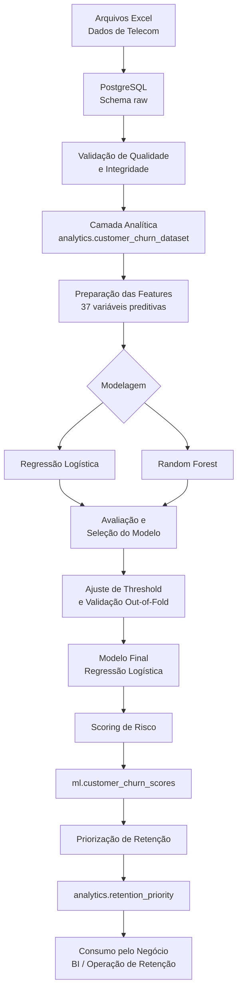
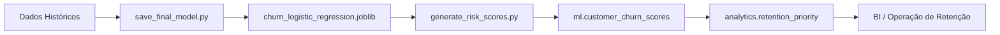

# Inteligência Preditiva de Clientes em Telecom

Projeto end-to-end de **Ciência de Dados e Machine Learning** para previsão de churn, priorização de risco e apoio a estratégias de retenção de clientes no setor de telecomunicações.

A solução integra **Python, PostgreSQL, SQL, Docker, Scikit-learn, engenharia de atributos, avaliação de modelos, interpretabilidade, scoring de risco e priorização operacional**.

---

## Status do Projeto

Projeto em desenvolvimento.

As principais etapas de engenharia de dados, modelagem preditiva, avaliação, interpretação e scoring já estão implementadas.

---

## Problema de Negócio

O churn representa a perda de clientes e pode afetar diretamente:

- Receita recorrente
- Custo de aquisição de clientes
- Rentabilidade
- Planejamento comercial
- Estratégias de relacionamento e retenção

O objetivo deste projeto não é apenas prever se um cliente pode cancelar o serviço.

A principal pergunta de negócio é:

> **Quais clientes devem ser priorizados primeiro por uma operação de retenção?**

Para responder a essa pergunta, o projeto cobre um fluxo completo:

- Ingestão de dados
- Validação de qualidade
- Modelagem relacional
- Construção da camada analítica
- Preparação das features
- Machine Learning
- Ajuste de threshold
- Comparação de modelos
- Interpretabilidade
- Scoring de risco
- Validação Out-of-Fold
- Priorização operacional de retenção
- Persistência do modelo

---

# Base de Dados

A base analítica contém:

- **7.043 clientes**
- **1.869 clientes com churn**
- **26,54% de taxa geral de churn**

Os dados de origem estão distribuídos em diferentes arquivos com informações de:

- Dados demográficos
- Localização
- População
- Serviços contratados
- Faturamento
- Relacionamento
- Status do cliente

Essas fontes são integradas no PostgreSQL por meio de relacionamentos entre clientes e informações geográficas.

---

# Tecnologias Utilizadas

## Engenharia de Dados

- PostgreSQL
- Docker
- SQL
- Python
- Pandas
- SQLAlchemy
- Psycopg

## Ciência de Dados e Machine Learning

- Scikit-learn
- Regressão Logística
- Random Forest
- Validação cruzada
- One-Hot Encoding
- StandardScaler
- Permutation Importance
- Ajuste de threshold
- Out-of-Fold Prediction

## Desenvolvimento

- Python 3.11
- Conda
- VS Code
- Git
- GitHub

---

# Arquitetura da Solução



---

# Arquitetura do Banco de Dados

O ambiente PostgreSQL foi organizado em três schemas principais:

```text
raw
analytics
ml
```

---

## Schema `raw`

Responsável pelo armazenamento dos dados provenientes das fontes originais.

Principais tabelas:

```text
raw.demographics
raw.location
raw.population
raw.services
raw.status
```

A camada preserva:

- Integridade referencial
- Relacionamentos entre clientes
- Relacionamentos geográficos
- Dados necessários para as etapas posteriores

---

## Schema `analytics`

Responsável pelas estruturas preparadas para análise e consumo pelo negócio.

Principais objetos:

```text
analytics.customer_churn_dataset
analytics.retention_priority
```

---

## Schema `ml`

Responsável pelo armazenamento das saídas produzidas pelo modelo de Machine Learning.

Principal tabela:

```text
ml.customer_churn_scores
```

---

# Qualidade dos Dados

Antes da modelagem foram realizadas validações de qualidade e integridade.

Principais resultados:

- 7.043 clientes únicos
- Nenhum `customer_id` duplicado
- Integridade referencial validada
- Relacionamentos entre clientes preservados
- Relacionamentos de CEP validados
- Valores ausentes analisados
- Distribuição do target preservada após integração

Valores ausentes com significado estrutural foram tratados explicitamente:

```text
offer         → No Offer
internet_type → No Internet
```

---

# Dataset Analítico

A view:

```text
analytics.customer_churn_dataset
```

consolida dados provenientes de:

- Demografia
- Localização
- População
- Serviços
- Faturamento
- Relacionamento
- Target de churn

Dimensões do dataset:

```text
7.043 registros
43 colunas
```

---

# Preparação das Features

Algumas colunas foram removidas do conjunto utilizado pelo modelo inicial.

Exemplos:

```text
customer_id
country
state
city
zip_code
```

Principais motivos:

- Identificadores não representam características comportamentais
- Algumas variáveis eram constantes
- Algumas possuíam alta cardinalidade
- O objetivo inicial era construir um baseline controlado e interpretável

O modelo utiliza:

```text
37 features
```

Entre elas:

- Idade
- Senioridade etária
- Dependentes
- Tempo como cliente
- Tipo de contrato
- Tipo de internet
- Mensalidade
- Receita total
- Indicações
- Serviços online
- Streaming
- Forma de pagamento

---

# Variável Alvo

A variável utilizada para previsão é:

```text
churn_value
```

Onde:

```text
0 = Cliente permaneceu
1 = Cliente saiu
```

Distribuição:

```text
Sem churn: 5.174
Com churn: 1.869
```

Taxa geral:

```text
26,54%
```

---

# Prevenção de Data Leakage

Variáveis diretamente relacionadas ao resultado conhecido do churn foram removidas das features preditivas.

Exemplos:

```text
customer_status
churn_label
churn_score
churn_category
churn_reason
```

Essas informações poderiam revelar direta ou indiretamente aquilo que o modelo deveria prever.

Também foram inicialmente excluídas variáveis cuja disponibilidade temporal não estava suficientemente estabelecida para o cenário preditivo.

O objetivo é evitar que o modelo utilize informações que não estariam disponíveis no momento real da decisão.

---

# Modelos Avaliados

Foram avaliados dois algoritmos de classificação supervisionada.

## Regressão Logística

Utilizada inicialmente como baseline devido a:

- Boa interpretabilidade
- Baixo custo computacional
- Geração direta de probabilidades
- Boa adequação a classificação binária

## Random Forest

Utilizado como modelo challenger para testar possíveis ganhos provenientes de relações não lineares.

---

# Validação Cruzada

Foi realizada validação cruzada estratificada com 5 folds sobre o conjunto de desenvolvimento.

Resultados médios:

| Métrica | Regressão Logística | Random Forest |
|---|---:|---:|
| ROC AUC | 0,8957 | 0,8961 |
| PR AUC | 0,7589 | 0,7625 |
| Precision | 0,7141 | 0,6618 |
| Recall | 0,6629 | 0,7418 |
| F1 | 0,6875 | 0,6995 |

Os modelos apresentaram capacidade de discriminação semelhante, mas com diferenças no equilíbrio entre precision e recall.

---

# Protocolo de Avaliação

Para a comparação posterior foi utilizado um novo particionamento:

```text
Treino:     4.929
Validação:  1.057
Teste:      1.057
```

O threshold operacional foi escolhido utilizando o conjunto de validação.

---

# Modelo Selecionado

O modelo mantido como principal foi:

## Regressão Logística

Além do desempenho competitivo, possui vantagens importantes para este projeto:

- Interpretabilidade
- Simplicidade operacional
- Facilidade de manutenção
- Probabilidades diretamente utilizáveis para scoring
- Boa capacidade de discriminação

O Random Forest permanece como modelo challenger.

---

# Resultado da Regressão Logística

Resultado obtido no conjunto separado de teste:

| Métrica | Resultado |
|---|---:|
| ROC AUC | **0,9030** |
| PR AUC | **0,7734** |
| Recall | **0,9500** |
| Precision | 0,4836 |
| F1 | 0,6410 |
| F2 | **0,7964** |

O modelo apresentou boa capacidade de ordenar clientes de acordo com o risco de churn.

---

# Ajuste do Threshold

Classificadores binários normalmente utilizam:

```text
threshold = 0,50
```

Entretanto, em um cenário de retenção, deixar de identificar um cliente que pode cancelar pode ser mais custoso do que abordar um cliente que posteriormente permaneceria.

Por isso, foi utilizado:

```text
F2 Score
```

O F2 atribui maior peso ao recall.

O threshold selecionado na validação foi:

```text
0,10
```

Com esse ponto de decisão, o modelo apresentou no conjunto separado:

```text
Recall = 95,00%
```

Isso representa uma configuração orientada para maior cobertura dos clientes em risco.

O trade-off é o aumento de falsos positivos.

---

# Comparação com Random Forest

No mesmo protocolo, o Random Forest apresentou:

| Métrica | Regressão Logística | Random Forest |
|---|---:|---:|
| Accuracy | 0,7181 | 0,7143 |
| Precision | 0,4836 | 0,4800 |
| Recall | 0,9500 | 0,9429 |
| F1 | 0,6410 | 0,6361 |
| F2 | 0,7964 | 0,7904 |
| ROC AUC | 0,9030 | 0,9005 |
| PR AUC | 0,7734 | 0,7620 |

Os resultados reforçaram a escolha da Regressão Logística como modelo principal para o projeto.

---

# Interpretabilidade do Modelo

Foi utilizada **Permutation Importance** para avaliar quais variáveis mais contribuem para a capacidade preditiva.

Principais features:

| Feature | Importância |
|---|---:|
| Monthly Charge | 0,1565 |
| Number of Referrals | 0,1256 |
| Contract | 0,0872 |
| Tenure in Months | 0,0749 |
| Dependents | 0,0237 |
| Referred a Friend | 0,0227 |
| Internet Type | 0,0139 |
| Phone Service | 0,0127 |
| Streaming Movies | 0,0087 |
| Premium Tech Support | 0,0064 |
| Senior Citizen | 0,0057 |
| Internet Service | 0,0054 |
| Payment Method | 0,0043 |
| Offer | 0,0040 |
| Online Security | 0,0039 |

Permutation Importance mede contribuição preditiva.

Ela não deve ser interpretada automaticamente como relação causal.

---

# Principais Drivers Observados de Churn

Depois da análise de importância, foram avaliadas as taxas observadas de churn entre segmentos.

---

## Tipo de Contrato

```text
Month-to-Month → 45,84%
One Year       → 10,71%
Two Year       →  2,55%
```

Clientes com contratos mensais apresentam taxa observada de churn muito superior aos contratos de maior duração.

---

## Tempo como Cliente

```text
01–06 meses → 53,33%
07–12 meses → 35,34%
13–24 meses → 28,71%
25–48 meses → 20,39%
49–72 meses →  9,51%
```

Os primeiros meses do relacionamento representam uma faixa especialmente relevante para ações de retenção.

---

## Mensalidade

```text
Q1 - Menor valor → 11,24%
Q2               → 24,58%
Q3               → 37,51%
Q4 - Maior valor → 32,88%
```

A relação não é perfeitamente linear.

O terceiro quartil apresentou churn superior ao quartil de maior mensalidade.

Isso reforça a utilidade de uma análise multivariada.

---

## Indicações

```text
0 indicações   → 32,58%
1–2 indicações → 40,32%
3–5 indicações →  9,40%
6+ indicações  →  1,75%
```

Clientes com maior quantidade de indicações apresentam taxas observadas de churn significativamente menores.

Entretanto, a relação não é linear em todos os grupos.

---

## Dependentes

```text
Sem dependentes → 32,55%
Com dependentes →  6,52%
```

---

## Indicou um Amigo

```text
Não → 32,58%
Sim → 19,37%
```

---

## Tipo de Internet

```text
DSL          → 18,58%
Cable        → 25,66%
Fiber Optic  → 40,72%
Sem Internet →  7,40%
```

Clientes com Fiber Optic apresentam maior taxa observada de churn neste conjunto de dados.

Esses resultados representam associações presentes nos dados.

Eles não comprovam causalidade.

---

## Serviço de Telefonia

```text
Sem Phone Service → 24,93%
Com Phone Service → 26,71%
```

Isoladamente, essa variável apresenta diferença pequena entre os grupos.

---

# Validação Out-of-Fold do Ranking de Risco

Para avaliar a capacidade de priorização sem pontuar cada cliente com um modelo treinado naquele mesmo registro, foram produzidas previsões:

```text
Out-of-Fold
```

Foi utilizada validação estratificada com 5 folds.

Cada cliente recebeu uma probabilidade produzida por um modelo que não utilizou aquele registro em seu treinamento.

Depois disso, os clientes foram classificados em decis de risco.

---

# Performance por Decil de Risco

| Decil | Clientes | Churners | Taxa de Churn | Churn Capturado | Lift |
|---:|---:|---:|---:|---:|---:|
| 10 | 705 | 628 | 89,08% | 33,60% | 3,36x |
| 9 | 704 | 468 | 66,48% | 25,04% | 2,51x |
| 8 | 704 | 308 | 43,75% | 16,48% | 1,65x |
| 7 | 704 | 213 | 30,26% | 11,40% | 1,14x |
| 6 | 704 | 130 | 18,47% | 6,96% | 0,70x |
| 5 | 705 | 68 | 9,65% | 3,64% | 0,36x |
| 4 | 704 | 33 | 4,69% | 1,77% | 0,18x |
| 3 | 704 | 16 | 2,27% | 0,86% | 0,09x |
| 2 | 704 | 3 | 0,43% | 0,16% | 0,02x |
| 1 | 705 | 2 | 0,28% | 0,11% | 0,01x |

A taxa de churn diminui fortemente do decil de maior risco para o de menor risco.

---

# Top 10% de Maior Risco

Os 10% de clientes com maior score concentraram:

```text
33,60% de todos os churners
```

Taxa de churn:

```text
89,08%
```

Lift:

```text
3,36x
```

---

# Top 20%

Os 20% de maior risco concentraram:

```text
58,64% de todo o churn observado
```

---

# Top 30%

Os 30% de maior risco concentraram:

```text
75,12% de todo o churn observado
```

---

# Top 40%

Os 40% de maior risco concentraram:

```text
86,52% de todo o churn observado
```

---

# Top 50%

Os 50% de maior risco concentraram:

```text
93,47% de todo o churn observado
```

Esses resultados demonstram que o modelo pode ser utilizado como mecanismo de priorização.

Isso não significa que uma ação de retenção evitará necessariamente o churn desses clientes.

---

# Scoring de Risco

Depois da seleção do modelo, a Regressão Logística final foi treinada utilizando todo o histórico rotulado disponível.

Cada cliente recebe:

- Probabilidade de churn
- Percentil de risco
- Decil de risco
- Faixa de risco
- Predição operacional

---

# Faixas de Risco

As faixas são definidas pela posição relativa do cliente dentro do portfólio.

```text
Decis 1–3  → Low
Decis 4–6  → Medium
Decis 7–8  → High
Decis 9–10 → Critical
```

Distribuição:

| Faixa | Clientes |
|---|---:|
| Low | 2.113 |
| Medium | 2.113 |
| High | 1.408 |
| Critical | 1.409 |

Probabilidade média estimada por grupo:

```text
Low      → 0,0058
Medium   → 0,1031
High     → 0,4076
Critical → 0,7562
```

---

# Threshold Operacional

Para a classificação operacional:

```text
threshold = 0,10
```

Distribuição gerada:

```text
Predicted churn = 0 → 3.303 clientes
Predicted churn = 1 → 3.740 clientes
```

O threshold é propositalmente orientado para recall.

Por esse motivo, a quantidade de clientes sinalizados é elevada.

---

# Tabela de Scoring

Os resultados são persistidos em:

```text
ml.customer_churn_scores
```

Principais campos:

```text
customer_id
churn_probability
risk_percentile
risk_decile
risk_band
prediction_threshold
predicted_churn
actual_churn_value
scored_at
```

---

# Priorização de Retenção

A view:

```text
analytics.retention_priority
```

transforma os scores em uma fila operacional.

Ações sugeridas:

| Faixa de Risco | Ação |
|---|---|
| Critical | Ação imediata de retenção |
| High | Contato proativo de retenção |
| Medium | Monitorar e engajar |
| Low | Relacionamento padrão |

Distribuição operacional:

```text
Critical → 1.409
High     → 1.408
Medium   → 2.113
Low      → 2.113
```

Essa camada permite que os resultados sejam consumidos por uma operação de retenção ou ferramenta de BI.

---

# Exemplo de Priorização

Clientes com maior score aparecem no topo da fila operacional.

Entre os clientes de maior risco aparecem características como:

- Contrato Month-to-Month
- Baixo ou médio tempo de relacionamento
- Mensalidades relativamente elevadas
- Probabilidades de churn próximas de 1

A priorização é definida pelo modelo multivariado, e não por uma única característica isolada.

---

# Persistência do Modelo

O pipeline final é armazenado em:

```text
models/churn_logistic_regression.joblib
```

O artefato contém:

- Pipeline de pré-processamento
- Regressão Logística treinada
- Threshold operacional
- Lista de features
- Metadados do modelo

Isso permite separar treinamento de inferência.

---

# Fluxo de Treinamento e Inferência



O processo de scoring carrega o modelo persistido diretamente.

O modelo não precisa ser retreinado a cada execução.

---

# Estrutura do Projeto

```text
telecom-customer-predictive-intelligence/
│
├── data/
│   └── raw/
│
├── database/
│   ├── init/
│   └── sql/
│
├── models/
│   └── churn_logistic_regression.joblib
│
├── src/
│   ├── data/
│   ├── evaluation/
│   ├── features/
│   └── models/
│
├── docker-compose.yml
├── environment.yml
├── .gitignore
└── README.md
```

---

# Scripts de Ingestão

```text
src/data/load_raw_demographics.py
src/data/load_raw_population.py
src/data/load_raw_location.py
src/data/load_raw_services.py
src/data/load_raw_status.py
```

Esses scripts carregam os arquivos de origem para o PostgreSQL e executam validações antes da persistência.

---

# Conexão com PostgreSQL

```text
src/data/db_connection.py
```

Responsável pela criação reutilizável da conexão SQLAlchemy.

As credenciais são lidas por variáveis de ambiente.

O arquivo `.env` não é versionado no Git.

---

# Preparação das Features

```text
src/features/build_model_dataset.py
```

Responsabilidades:

- Carregar o dataset analítico
- Tratar valores estruturais ausentes
- Remover colunas inadequadas
- Separar features e target

---

# Modelagem

```text
src/models/train_baseline.py
src/models/tune_threshold.py
src/models/compare_models_cv.py
src/models/final_model_selection.py
```

Esses scripts cobrem:

- Baseline
- Avaliação inicial
- Ajuste de threshold
- Validação cruzada
- Comparação de modelos

---

# Interpretação

```text
src/models/interpret_model.py
```

Utiliza Permutation Importance para medir a contribuição das features originais.

---

# Persistência

```text
src/models/save_final_model.py
```

Treina a versão final e salva o pipeline completo como artefato `joblib`.

---

# Inferência

```text
src/models/generate_risk_scores.py
```

Responsabilidades:

- Carregar o modelo persistido
- Preparar as features
- Calcular probabilidades
- Criar percentis
- Criar decis
- Criar faixas de risco
- Aplicar o threshold
- Persistir scores no PostgreSQL

---

# Avaliação de Negócio

```text
src/evaluation/churn_driver_analysis.py
src/evaluation/evaluate_risk_deciles.py
```

Esses scripts permitem analisar:

- Drivers observados
- Taxas de churn
- Decis de risco
- Lift
- Captura acumulada de churn

---

# SQL Analítico

Principais scripts:

```text
database/sql/01_create_customer_churn_dataset.sql
database/sql/02_create_customer_churn_scores.sql
database/sql/03_create_retention_priority_view.sql
```

---

# Fluxo Completo

```text
Arquivos Excel
      ↓
Python / Pandas
      ↓
PostgreSQL
      ↓
Schema raw
      ↓
Qualidade e Integridade
      ↓
analytics.customer_churn_dataset
      ↓
Preparação das Features
      ↓
Regressão Logística
      ↓
Avaliação
      ↓
Threshold
      ↓
Modelo Persistido
      ↓
Risk Scoring
      ↓
ml.customer_churn_scores
      ↓
analytics.retention_priority
      ↓
BI / Retenção
```

---

# Principal Insight de Negócio

O projeto demonstra que previsão de churn pode gerar mais valor quando tratada também como um problema de:

> **priorização de clientes**

Uma operação de retenção não precisa abordar toda a carteira com a mesma intensidade.

A avaliação Out-of-Fold mostrou que:

> **Os 20% de clientes com maior risco concentraram 58,64% de todo o churn observado.**

Além disso:

```text
Top 10% → 33,60% do churn
Top 20% → 58,64%
Top 30% → 75,12%
Top 40% → 86,52%
Top 50% → 93,47%
```

Isso permite direcionar recursos para grupos com maior concentração de risco.

---

# Possível Aplicação em Power BI

A estrutura criada pode ser utilizada posteriormente em dashboards.

Possíveis indicadores:

- Total de clientes
- Taxa geral de churn
- Clientes críticos
- Clientes de alto risco
- Probabilidade média de churn
- Distribuição por faixa de risco
- Churn por contrato
- Churn por tenure
- Churn por tipo de internet
- Churn por mensalidade
- Churn por referrals
- Lift por decil
- Captura acumulada de churn
- Lista prioritária de clientes

---

# Exemplo de Dashboard Executivo

Uma possível organização futura no Power BI:

```text
Página 1
Visão Executiva
- Total de clientes
- Churn
- Clientes críticos
- Clientes de alto risco
- Distribuição de risco

Página 2
Drivers de Churn
- Contrato
- Tenure
- Mensalidade
- Internet
- Referrals

Página 3
Performance do Modelo
- ROC AUC
- PR AUC
- Recall
- F2
- Lift
- Decis

Página 4
Fila de Retenção
- Cliente
- Score
- Decil
- Faixa de risco
- Contrato
- Tenure
- Mensalidade
- Ação recomendada
```

---

# Limitações

Os resultados devem ser interpretados dentro do contexto deste dataset.

Algumas limitações importantes:

- Predição não significa causalidade
- Alto risco não significa churn certo
- Baixo risco não significa permanência garantida
- Uma campanha de retenção não necessariamente impedirá churn
- Os scores finais sobre todo o histórico servem para demonstrar o pipeline operacional, e não para substituir as métricas obtidas em avaliação separada

---

# Evoluções para um Ambiente Real

Uma implementação em produção deveria considerar:

- Dados temporais
- Monitoramento de drift
- Retreinamento periódico
- Recalibração das probabilidades
- Monitoramento de performance
- Versionamento de modelos
- Registro de experimentos
- Customer Lifetime Value
- Receita em risco
- Custo de contato
- Custo da oferta
- Margem do cliente
- Resultado das campanhas
- Taxa real de retenção
- Uplift Modeling
- Avaliação de efeito incremental

---

# Evolução da Estratégia de Retenção

Em um estágio mais avançado, a pergunta poderia deixar de ser apenas:

> Quem tem maior risco de churn?

e evoluir para:

> Em quais clientes uma intervenção de retenção realmente aumenta a probabilidade de permanência?

Essa evolução exigiria dados de campanhas e grupos de tratamento/controle.

---

# Conclusão

O projeto constrói um fluxo completo de inteligência preditiva para churn:

```text
Engenharia de Dados
        ↓
Qualidade
        ↓
Analytics
        ↓
Machine Learning
        ↓
Interpretabilidade
        ↓
Risk Scoring
        ↓
Priorização
        ↓
Decisão de Negócio
```

O objetivo central não é apenas produzir uma classificação.

O modelo é utilizado para transformar dados históricos em uma **fila priorizada de clientes**, permitindo que uma operação de retenção concentre esforços nos segmentos com maior risco estimado.

---

# Autor

**André Lutes Galvão**

Foco profissional:

- Análise de Dados
- Business Intelligence
- SQL
- Python
- Power BI
- Machine Learning aplicado
- ETL / ELT
- Qualidade de Dados
- Modelagem de Dados
- Analytics para Telecomunicações